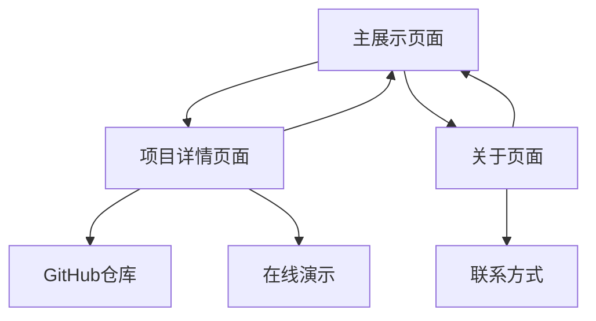

# GitHub项目展示平台 - Notion风格重设计

## 1. 产品概述

这不是一个简单的GitHub项目列表，而是一个具有Notion级别设计标准的知识展示平台。我们要打造一个让开发者沉浸其中、优雅浏览项目的数字空间。

产品的核心使命是将冰冷的代码仓库转化为有温度的知识资产，通过极简主义的设计语言和精致的交互体验，让每个项目都能得到应有的展示。

目标是成为开发者个人品牌展示的新标杆，重新定义技术项目的呈现方式。

## 2. 核心功能

### 2.1 用户角色

本产品采用单一用户模式，专注于为项目所有者提供最佳的展示体验。

### 2.2 功能模块

我们的重设计包含以下核心页面：

1. **主展示页面**：沉浸式项目浏览体验，智能搜索与筛选系统
2. **项目详情页面**：深度项目信息展示，优雅的代码预览
3. **关于页面**：个人品牌故事展示

### 2.3 页面详情

| 页面名称 | 模块名称 | 功能描述 |
|---------|---------|----------|
| 主展示页面 | 顶部导航栏 | 极简logo展示，搜索入口，主题切换。采用Notion式的悬浮设计 |
| 主展示页面 | 智能搜索系统 | 实时模糊搜索，智能标签建议，搜索历史。支持快捷键操作 |
| 主展示页面 | 项目卡片网格 | 响应式瀑布流布局，悬停微动效，渐进式加载。每个卡片都是艺术品 |
| 主展示页面 | 高级筛选面板 | 侧边栏筛选器，技术栈分类，时间轴筛选，星标数排序 |
| 主展示页面 | 统计仪表板 | 项目总览数据，技术栈分布图，活跃度热力图 |
| 项目详情页面 | 项目头部信息 | 大标题展示，关键指标可视化，快速操作按钮组 |
| 项目详情页面 | 代码预览模块 | 语法高亮代码展示，文件树导航，在线预览功能 |
| 项目详情页面 | 项目时间线 | 提交历史可视化，里程碑展示，贡献者信息 |
| 关于页面 | 个人简介区域 | 头像展示，技能标签云，联系方式，个人故事 |
| 关于页面 | 技术栈展示 | 交互式技能图表，经验时长可视化，项目关联 |

## 3. 核心流程

**主要用户操作流程：**

用户进入主页 → 被优雅的视觉设计吸引 → 通过智能搜索或浏览发现感兴趣的项目 → 点击项目卡片进入详情页 → 深度了解项目信息 → 通过外链访问GitHub仓库或在线演示 → 返回主页继续探索或访问关于页面了解作者

**页面导航流程图：**

## 4. 用户界面设计

### 4.1 设计风格

**色彩系统：**
- 主色调：纯净白色 (#FFFFFF) 和深邃黑色 (#000000)
- 辅助色：温暖灰色系列 (#F7F6F3, #E9E9E7, #CBCAC8)
- 强调色：Notion蓝 (#2383E2) 和警示橙 (#FF6B35)
- 文字色彩：主文字 (#2F2F2F)，次要文字 (#6F6F6F)，辅助文字 (#A0A0A0)

**字体系统：**
- 主字体：Inter (现代无衬线，极佳的屏幕显示效果)
- 代码字体：JetBrains Mono (等宽字体，代码展示专用)
- 字号层级：12px/14px/16px/20px/24px/32px/48px

**设计原则：**
- 按钮风格：圆角8px，悬停状态微妙阴影，点击反馈
- 布局风格：大量留白，内容居中，最大宽度1200px
- 动效风格：缓动函数 ease-out，持续时间200-300ms
- 图标风格：线性图标，2px描边，24px标准尺寸

### 4.2 页面设计概览

| 页面名称 | 模块名称 | UI元素 |
|---------|---------|--------|
| 主展示页面 | 顶部导航栏 | 高度64px，背景模糊效果，固定定位。Logo使用Inter字体，搜索框圆角12px |
| 主展示页面 | 项目卡片 | 白色背景，圆角16px，悬停阴影0 8px 32px rgba(0,0,0,0.12)。标题使用Inter Medium 18px |
| 主展示页面 | 筛选面板 | 侧边栏宽度280px，背景#F7F6F3，分组标题Inter SemiBold 14px |
| 项目详情页面 | 项目头部 | 大标题Inter Bold 32px，指标卡片使用圆角12px，间距24px |
| 项目详情页面 | 代码预览 | 背景#1E1E1E，圆角12px，JetBrains Mono 14px，行高1.5 |
| 关于页面 | 个人简介 | 头像圆形120px，技能标签圆角20px，背景渐变色 |

### 4.3 响应式设计

产品采用移动优先的响应式设计策略：
- 桌面端：1200px+ 三列网格布局，侧边栏固定
- 平板端：768px-1199px 两列网格，侧边栏可收起
- 移动端：<768px 单列布局，底部导航，手势优化

支持触摸交互优化，包括滑动切换、长按菜单、双击缩放等移动端专属交互。