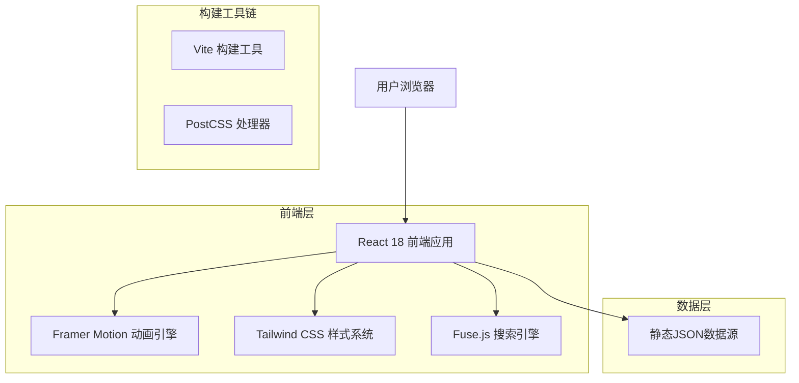
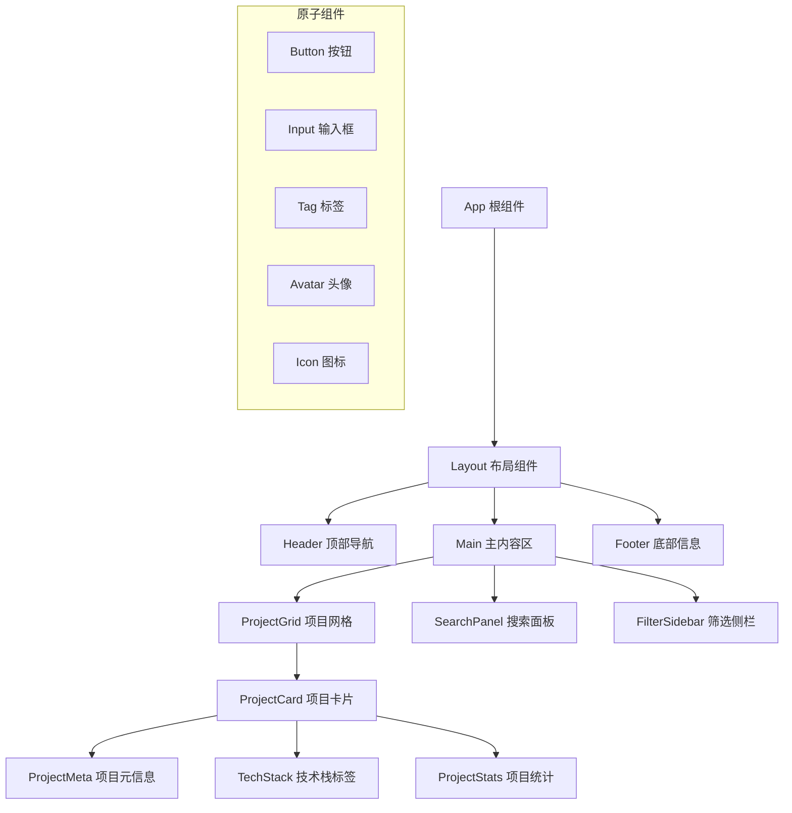

# GitHub项目展示平台 - 技术架构设计

## 1. 架构设计



## 2. 技术描述

* **前端框架**: React\@18 + TypeScript\@5 + Vite\@6

* **样式系统**: Tailwind CSS\@3 + PostCSS\@8 + Autoprefixer\@10

* **动画库**: Framer Motion\@11 (实现Notion级别的微交互)

* **搜索引擎**: Fuse.js\@7 (模糊搜索和智能筛选)

* **图标系统**: Lucide React\@0.400+ (一致的线性图标)

* **字体**: Inter字体族 + JetBrains Mono (代码显示)

* **构建优化**: Vite插件生态 + 代码分割 + 懒加载

## 3. 路由定义

| 路由           | 用途                |
| ------------ | ----------------- |
| /            | 主展示页面，项目网格展示和搜索功能 |
| /project/:id | 项目详情页面，深度展示单个项目信息 |
| /about       | 关于页面，个人品牌和技能展示    |
| /search      | 高级搜索页面，复杂筛选和排序功能  |

## 4. 组件架构设计

### 4.1 核心组件层次



### 4.2 状态管理架构

```typescript
// 全局状态接口定义
interface AppState {
  projects: Project[];
  searchTerm: string;
  selectedTags: string[];
  sortMethod: 'default' | 'stars' | 'updated' | 'name';
  viewMode: 'grid' | 'list' | 'masonry';
  theme: 'light' | 'dark' | 'auto';
  isLoading: boolean;
  error: string | null;
}

// 项目数据接口
interface Project {
  id: string;
  full_name: string;
  description: string;
  html_url: string;
  homepage?: string;
  stargazers_count: number;
  language: string;
  topics: string[];
  updated_at: string;
  created_at: string;
  ai_tag?: {
    tags: string[];
    category: string;
    complexity: 'beginner' | 'intermediate' | 'advanced';
  };
}
```

## 5. 样式系统架构

### 5.1 Tailwind配置扩展

```javascript
// tailwind.config.js 核心配置
module.exports = {
  content: ['./src/**/*.{js,jsx,ts,tsx}'],
  theme: {
    extend: {
      fontFamily: {
        'sans': ['Inter', 'system-ui', 'sans-serif'],
        'mono': ['JetBrains Mono', 'monospace'],
      },
      colors: {
        notion: {
          blue: '#2383E2',
          gray: {
            50: '#F7F6F3',
            100: '#E9E9E7',
            200: '#CBCAC8',
            300: '#A0A0A0',
            400: '#6F6F6F',
            500: '#2F2F2F',
          }
        }
      },
      animation: {
        'fade-in': 'fadeIn 0.3s ease-out',
        'slide-up': 'slideUp 0.3s ease-out',
        'scale-in': 'scaleIn 0.2s ease-out',
      },
      boxShadow: {
        'notion': '0 8px 32px rgba(0, 0, 0, 0.12)',
        'notion-hover': '0 12px 48px rgba(0, 0, 0, 0.18)',
      }
    }
  }
}
```

### 5.2 组件样式规范

```css
/* 核心样式变量 */
:root {
  --spacing-unit: 8px;
  --border-radius-sm: 8px;
  --border-radius-md: 12px;
  --border-radius-lg: 16px;
  --transition-fast: 0.15s ease-out;
  --transition-normal: 0.3s ease-out;
  --transition-slow: 0.5s ease-out;
}

/* 通用组件基础样式 */
.notion-card {
  @apply bg-white rounded-lg shadow-notion hover:shadow-notion-hover;
  @apply transition-all duration-300 ease-out;
  @apply border border-gray-100;
}

.notion-button {
  @apply px-4 py-2 rounded-lg font-medium;
  @apply transition-all duration-200 ease-out;
  @apply focus:outline-none focus:ring-2 focus:ring-notion-blue focus:ring-opacity-50;
}

.notion-input {
  @apply w-full px-4 py-3 rounded-lg border border-gray-200;
  @apply focus:border-notion-blue focus:ring-2 focus:ring-notion-blue focus:ring-opacity-20;
  @apply transition-all duration-200 ease-out;
}
```

## 6. 性能优化策略

### 6.1 代码分割和懒加载

```typescript
// 路由级别的代码分割
const ProjectDetail = lazy(() => import('./pages/ProjectDetail'));
const About = lazy(() => import('./pages/About'));
const Search = lazy(() => import('./pages/Search'));

// 组件级别的懒加载
const HeavyChart = lazy(() => import('./components/HeavyChart'));
```

### 6.2 图片和资源优化

* 使用WebP格式图片，fallback到PNG

* 实现图片懒加载和渐进式加载

* SVG图标内联优化

* 字体子集化，只加载需要的字符

### 6.3 搜索性能优化

```typescript
// 搜索防抖和缓存策略
const useOptimizedSearch = () => {
  const [searchResults, setSearchResults] = useState([]);
  const searchCache = useRef(new Map());
  
  const debouncedSearch = useMemo(
    () => debounce((term: string) => {
      if (searchCache.current.has(term)) {
        setSearchResults(searchCache.current.get(term));
        return;
      }
      
      const results = fuse.search(term);
      searchCache.current.set(term, results);
      setSearchResults(results);
    }, 300),
    []
  );
  
  return { searchResults, debouncedSearch };
};
```

## 7. 部署和构建配置

### 7.1 Vite构建优化

```javascript
// vite.config.js
export default defineConfig({
  plugins: [react()],
  build: {
    rollupOptions: {
      output: {
        manualChunks: {
          vendor: ['react', 'react-dom'],
          animations: ['framer-motion'],
          search: ['fuse.js'],
        }
      }
    },
    chunkSizeWarningLimit: 1000,
  },
  optimizeDeps: {
    include: ['react', 'react-dom', 'framer-motion', 'fuse.js']
  }
});
```

### 7.2 静态资源处理

* 项目数据通过静态JSON文件提供

* 支持增量更新和版本控制

* CDN部署优化，全球加速访问

* Gzip压缩和Brotli压缩支持

